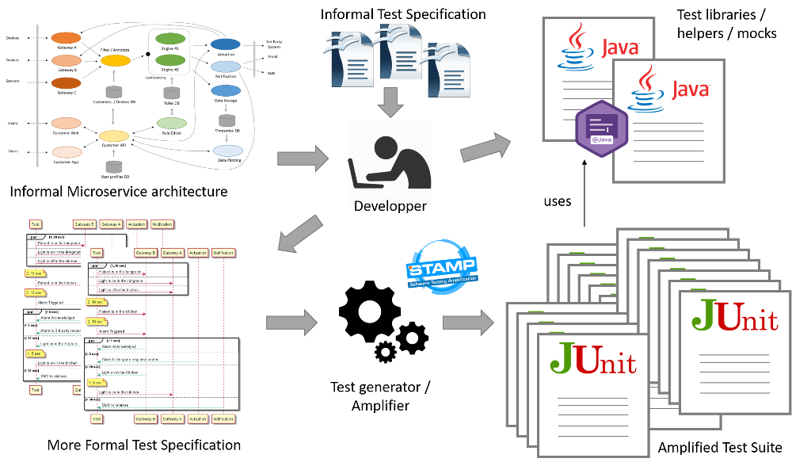

## MFTS stands for "More Formal Test Specification". 

It is a language and tool to specify test cases for distributed microservice architectures using a MSC-like fomalism.

The general idea of the tool is described on the following figure:

